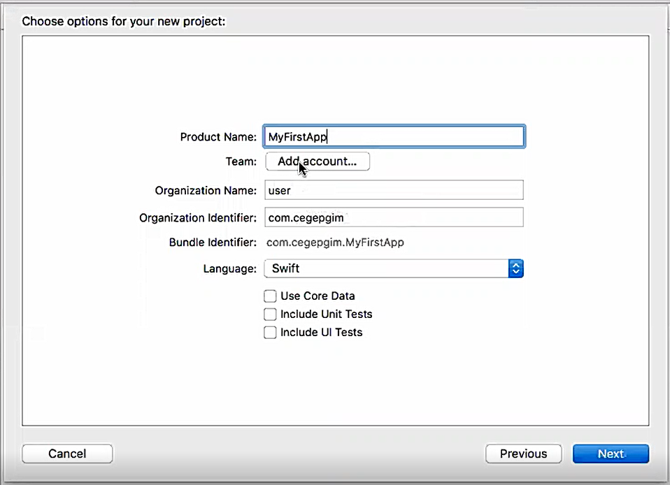

**What is Xcode?**

Xcode is an _Integrated Development Environment_ (IDE) for developing apps in the Apple ecosystem. We&#39;ll be focusing on iOS apps, but you can also make apps for macOS, watchOS, and tvOS apps. IDEs (like Xcode) contain and integrate many powerful tools that make software development easier for programmers.

Create a new Xcode project:

1. Open _Xcode_ on your computer. You should see the following launch window after you open Xcode

2. Next, from the launch window&#39;s quick options click Create a new Xcode project

3. You should see the following prompt to select a template for your new project. Under _iOS_, select _Single View App_

4. With your selected template, click _Next_. You should see a new prompt for your project details.In this new prompt, we&#39;ll set some basic info and details that Xcode needs to create a new project.After filling out your project details above, click _Next_.

5. Xcode will now prompt you to select where you&#39;d like to store your project. Using the file navigator, choose to a place on your computer to store your project. If you don&#39;t have a place in mind, you can use your Documents folder.
6. Make sure you keep the _Source Control_ checkbox selected for _Create Git repository on my Mac_.After you&#39;ve selected a project location and verified that the _Source Control_ checkbox is selected, click the Create button.

Creating a program:

1.	After creating the project successfully, go to LaunchScreen.storyboard.

2.	Add components or elements(labels) to display 

3.	Goto Main.storyboard then create a label with text “Hello CEGEP”.

4.	Create a button and name it as “Change the Text”

5.	Goto ViewController and include IBOutlet and IBAction.
@IBOutlet is a way of connecting code to storyboard layouts, and @IBAction is a way of making storyboard layouts trigger code. This method takes one parameter, called sender . It's of type UIButton because we know that's what will be calling the method.

6.	Goto Main.Storyboard and create the events.

